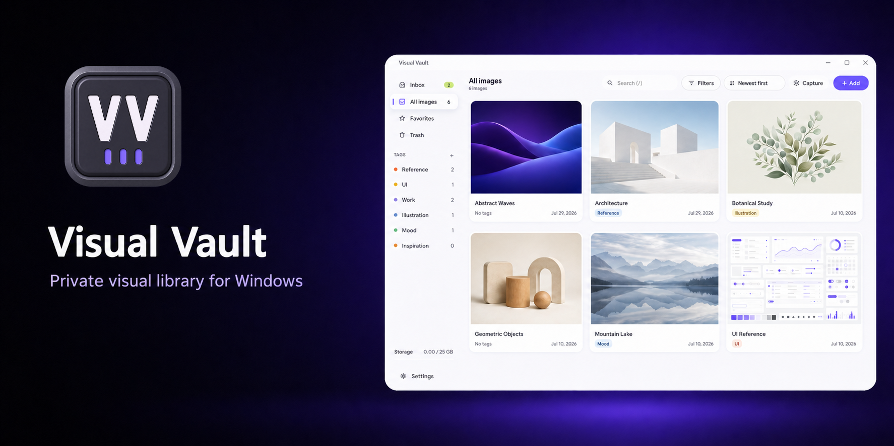
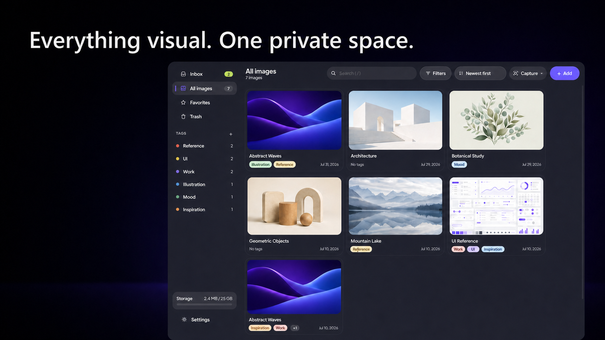
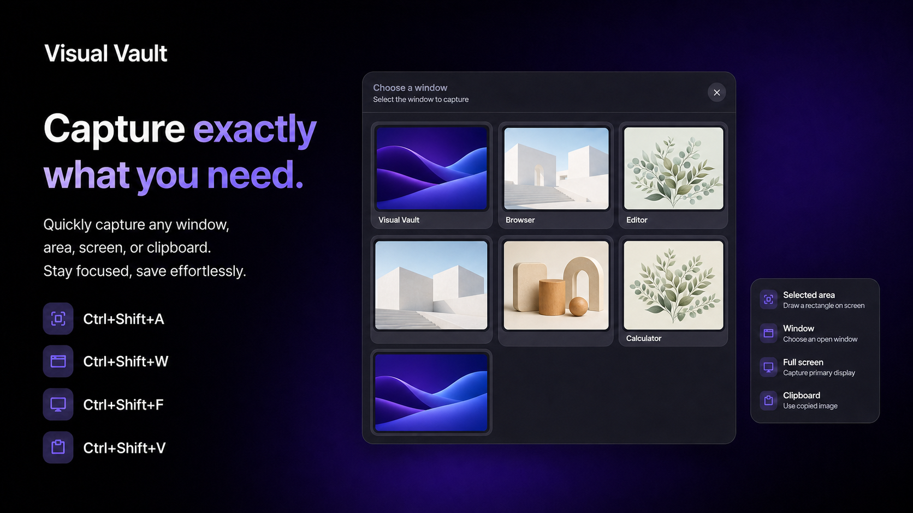
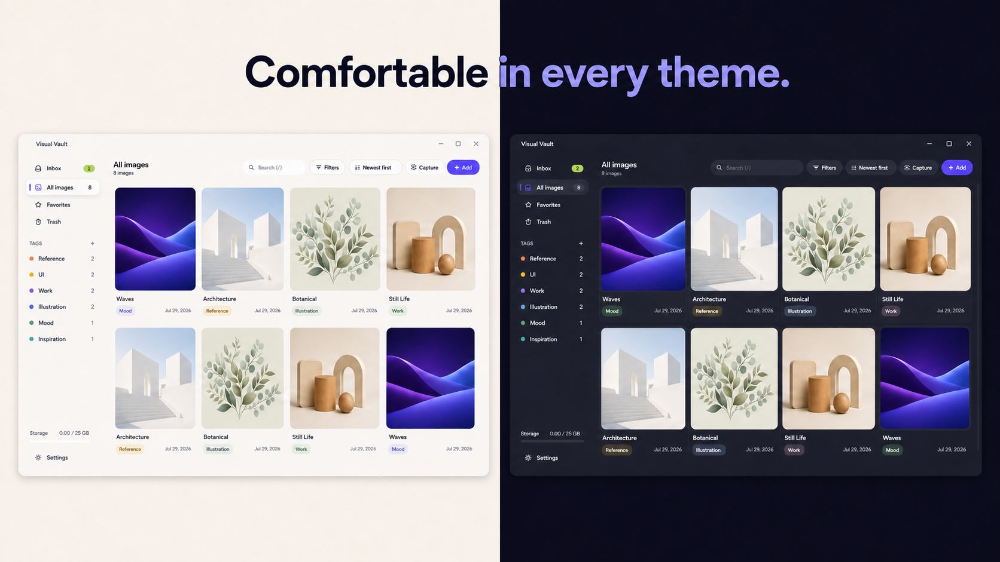
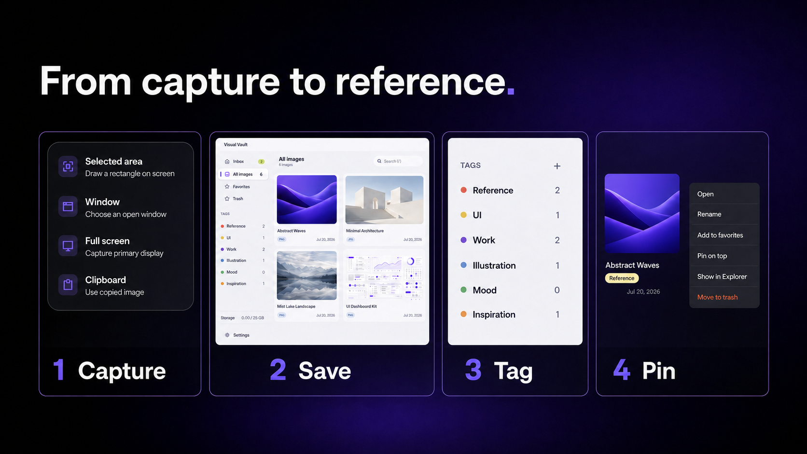
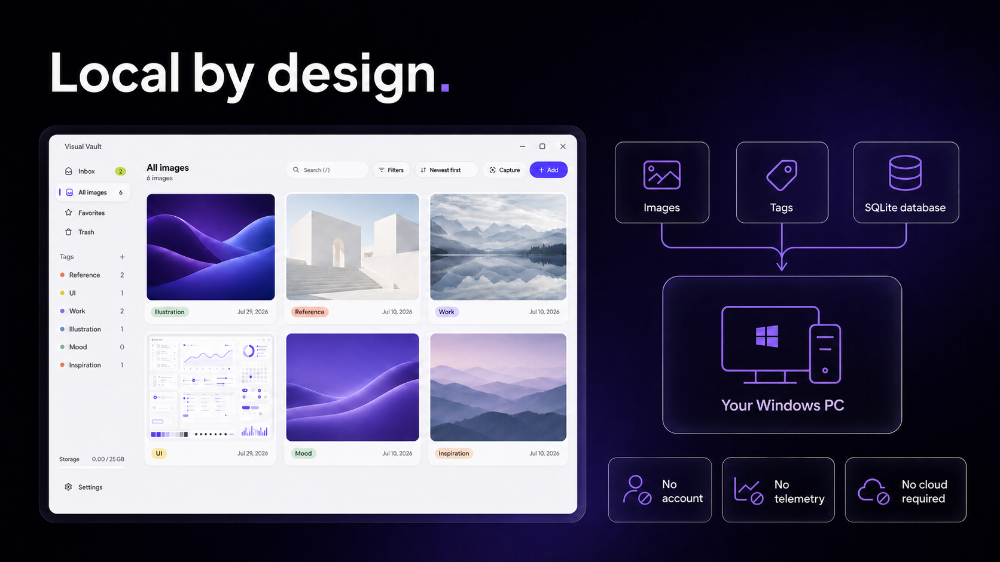

# Visual Vault

Локальный каталог для скриншотов и визуальных референсов. Изображения, теги и база данных хранятся на компьютере; сетевых запросов приложение не выполняет.



> Статус: production. Текущая версия — 0.5.7. Windows EXE распространяются без цифровой подписи.

## Возможности

- импорт PNG, JPEG, WebP, GIF, BMP и AVIF;
- захват экрана, окна, выбранной области и буфера обмена;
- теги, избранное, корзина, поиск, фильтры и сортировка;
- закреплённые поверх окон референсы;
- светлая/тёмная тема, русский/английский интерфейс;
- глобальная горячая клавиша и режим в трее;
- резервные копии, экспорт настроек и проверка SQLite-базы;
- installer и portable EXE.

## Обзор интерфейса

| Библиотека | Захват |
| --- | --- |
|  |  |

| Светлая и тёмная темы | Рабочий процесс |
| --- | --- |
|  |  |

### Локальное хранение



## Системные требования

- Windows 10/11 x64;
- около 250 МБ для приложения плюс место под библиотеку;
- для сборки: Node.js 22+ и npm.

## Данные и приватность

По умолчанию библиотека находится в `%USERPROFILE%\Pictures\Visual Vault`:

```text
Visual Vault/
├─ vault.db
├─ originals/
└─ backups/
```

Portable означает запуск без установки. Данные намеренно остаются в стандартной папке Pictures, поэтому обновление EXE не скрывает существующую библиотеку. Телеметрии, аккаунта и облачной синхронизации нет.

## Разработка

```powershell
npm ci
npm run check
npm start
```

Сборки:

```powershell
npm run dist:portable
npm run dist
```

Результаты: `release-portable/Visual-Vault-Portable-0.5.7.exe` и `release-v3-final/Visual-Vault-Setup-0.5.7.exe`.

## Релиз

Полный процесс: [docs/RELEASE_CHECKLIST.md](docs/RELEASE_CHECKLIST.md). Технический и UI/UX-аудит: [docs/AUDIT_2026-08-03.md](docs/AUDIT_2026-08-03.md).

## Безопасность

Уязвимости сообщайте приватно через GitHub Security Advisories. Подробности: [SECURITY.md](SECURITY.md).

## Лицензия

[MIT](LICENSE) — разрешено использовать, изменять и распространять код с сохранением copyright notice и текста лицензии.
